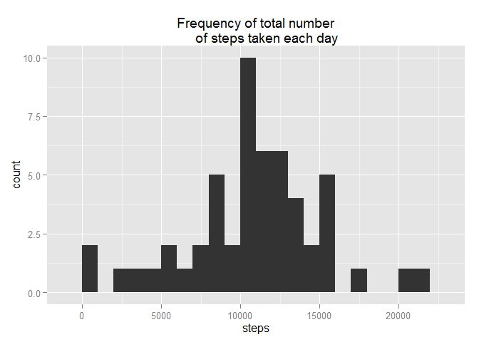
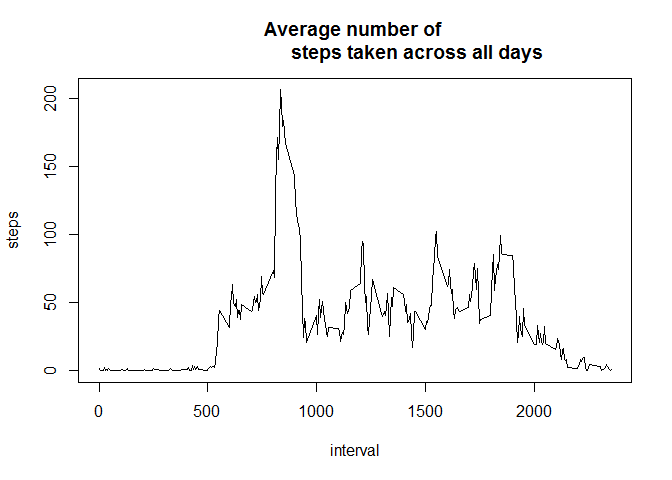
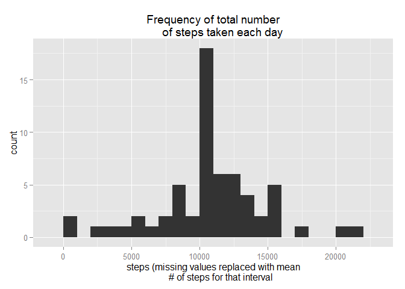

# Reproducible Research: Peer Assessment 1


## Loading and preprocessing the data

Assuming the data is in the working directory and still zipped, I first unzip 
the data. I then read it into R and preserve the headers.


```r
unzip("activity.zip")
raw <- read.csv("activity.csv", header=TRUE)
```

## What is mean total number of steps taken per day?

Using the dplyr package I group the data by date and take the sum of the number
of steps each day. Per the instructions, I ignore missing values. 

```r
library(plyr)
library(dplyr, warn.conflicts = FALSE)
daily <- group_by(raw,date)
missing <- is.na(raw$steps)
daily.sum <- summarise_each(daily[!missing,], funs(sum), steps)
```

I plot the result in a histogram.

```r
library(ggplot2)
qplot(steps, data=daily.sum, binwidth = 1000, main = "Frequency of total number
      of steps taken each day")
```

 

Mean and median of the total number of steps taken per day

```r
mean(daily.sum$steps)
```

```
## [1] 10766.19
```

```r
median(daily.sum$steps)
```

```
## [1] 10765
```

## What is the average daily activity pattern?

To make a time series plot of the 5-minute interval (x-axis) and the average 
number of steps taken averaged across all days (y-axis), I group the data by 
interval and take the mean number of steps over each interval.

```r
timeofday <- group_by(raw,interval)
timeofday.avg <- summarise_each(timeofday[!missing,], funs(mean), steps)
with(timeofday.avg, plot(interval, steps,type = "l", main = "Average number of 
                         steps taken across all days"))
```

 

The plot shows clearly that there is little activity during the nighttime hours,
a burst of activity in the morning, and moderate activity during the day.

I find the 5-minute interval, on average across all the days in the dataset, 
that contains the maximum number of steps. This appears to be in the morning.

```r
timeofday.avg[timeofday.avg$steps == max(timeofday.avg$steps),]
```

```
## Source: local data frame [1 x 2]
## 
##   interval    steps
## 1      835 206.1698
```

## Imputing missing values

I previously created a logical vector, 'missing', that identified the missing 
values in the dataset. I can calculate the total number of missing values by
summing this vector.

```r
sum(missing)
```

```
## [1] 2304
```

I fill in the missing values with the the mean of the corresponding 5-minute 
interval and again plot a histogram of the total number of steps taken each 
day.

```r
impute.mean <- function(x) replace(x, is.na(x), mean(x, na.rm = TRUE))
impute <- ddply(raw, ~ interval, transform, steps = impute.mean(steps))
daily2 <- group_by(impute,date)
daily2.sum <- summarise_each(daily2, funs(sum), steps)
qplot(steps, data=daily2.sum, binwidth = 1000, main = "Frequency of total number
      of steps taken each day", xlab = "steps (missing values replaced with mean
      # of steps for that interval")
```

 

The mean of the total number of steps taken per day is the same as before the
addition of the imputed values, while the median is very close to being the same
as before the addition of the imputed values.

```r
mean(daily2.sum$steps)
```

```
## [1] 10766.19
```

```r
median(daily2.sum$steps)
```

```
## [1] 10766.19
```

My method of imputing the missing values did not change the central tendency of
the total steps taken each day, but the distribution changed such that the
number of days in the peak bin increased.

## Are there differences in activity patterns between weekdays and weekends?

I create a new factor variable in the imputed dataset with two levels - 
"weekday" and "weekend" indicating whether a given date is a weekday or weekend 
day. I use this new variable to make a panel plot containing a time series plot
of the 5-minute interval (x-axis) and the average number of steps taken, 
averaged across all weekday days or weekend days (y-axis).


```r
impute$weekend <- ""
impute[,2] <- as.Date(impute[,2],"%Y-%m-%d")
for (i in 1:nrow(impute)){
    if (weekdays(impute[i,2]) %in% c('Sunday','Saturday')) {
        impute$weekend[i] <- "weekend"

    } else {
        impute$weekend[i] <- "weekday"
        }
}
timeofday2 <- group_by(impute,interval, weekend)
timeofday2.avg <- summarise_each(timeofday2, funs(mean), steps, weekend)
library(lattice)
with(timeofday2.avg, xyplot(steps ~ interval | weekend, layout = c(1,2), type = "l"))
```

 

The key difference during waking hours is the weekday activity level exhibits a 
spike during the morning  while the weekend exhibits a more uniform activity 
level.
